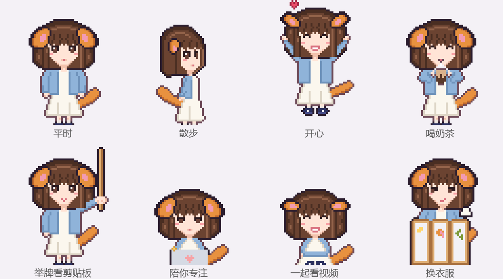

# Desktop Pet · 可以自己定制的像素桌宠

一只住在 Windows 任务栏上方的像素小人。这个仓库是一个**预制包**：引擎、动作、功能都做好了，附带一只示例宠物「小柴」。你可以照着教程，用 [Claude Code](https://claude.com/claude-code) 把它改成**你自己的宠物**：照你（或者你的朋友、你家猫）的样子画，有自己的名字、口头禅、爱吃的东西和衣服。



👉 **想做自己的宠物：看 [用 Claude Code 做一只自己的桌宠（详细教程）](docs/TUTORIAL_CLAUDE_CODE.md)**

## 它会做什么
- **日常**：
  - 在屏幕两边散步、发呆、坐下、打瞌睡。
  - 被戳会生气，摸头会开心，拎起来会挣扎，扔出去会摔晕。
- **喂东西吃**：吃多了要上厕所，偶尔还会放屁。
- **举牌看剪贴板**：你复制东西时，举块小牌子给你看。
  - 剪贴板记录在「小窝」里。
  - 像密码的内容会打码。
- **番茄钟**：抱着小电脑陪你专注。
- **提醒**：喝水、久坐、熬夜提醒，还有待办便签。
- **换装和发型**：衣柜里换衣服（在屏风后面换），喝生发药水变长发、剪头发变短发。
- **防干扰模式**：学习时躲到任务栏后面只露半个脑袋，或者安静陪伴、完全隐身。
  - 「专注监督」：在分心网站上待久了会被抓包。
- **陪看**：你看视频、看直播时，它坐到一边陪你看，偶尔笑一下，从不催你。
- **自定义台词**：在「小窝 → 台词」里自己教它说话。
- **两只一起**：两只宠物可以同时开，会互相打招呼、串门、一起躲。

## 轻、不打扰
- **不用安装**：一个 exe，不用装任何运行库（Windows 10/11 自带 .NET Framework 4.8）。exe 大约 0.7MB。
- **占用低**：平时 CPU 约 0.3% 单核，睡觉 0.1%。全屏游戏时自动躲起来，完全不占资源。
- **不抢焦点**：点它不会抢走你窗口的焦点，透明的地方可以点穿。
- **隐私**：
  - 剪贴板记录默认只在内存里。
  - 窗口标题只在本机比对，不保存、不上传。

## 编译和运行
除了 Windows 自带的 C# 编译器，什么都不用装。在仓库文件夹里打开 PowerShell：

```powershell
Set-ExecutionPolicy -Scope CurrentUser RemoteSigned   # 第一次需要：允许运行本地脚本
.\build.ps1 art      # 从 art\<宠物>\ 的文本源文件生成图集
.\build.ps1          # 编译，得到 out\<编号>.exe
.\build.ps1 run      # 编译并运行
.\build.ps1 test     # 跑单元测试
.\build.ps1 dist     # 打包成 zip，发给朋友
.\build.ps1 new 名字  # 复制示例宠物，开始做你自己的
```

所有命令都可以加 `-Char <宠物>`，只处理其中一只。

## 做自己的宠物
- **两种做法**：
  - 推荐用 Claude Code 帮你做，看 [教程](docs/TUTORIAL_CLAUDE_CODE.md)。
  - 想手动改，看 [宠物由哪些文件组成](docs/MAKE_YOUR_PET.md) 和 [怎么改像素图](art/README.md)。
- **照片放哪**：做宠物用的照片放进 `reference_pics/`，这个文件夹在 `.gitignore` 里，不会被提交。

## 目录
| 路径 | 内容 |
|---|---|
| `src/Core/` | 行为引擎、物理、图集格式、角色档（纯逻辑，可测试） |
| `src/App/` | 窗口、渲染、托盘、剪贴板、小窝 |
| `src/Tests/` | 单元测试（也检查每只宠物的角色档和台词是否齐全） |
| `art/<宠物>/` | 像素图的文本源文件：调色板、部件、动作表、衣服、造型 |
| `art/tool/` | 把文本源文件变成图集的构建工具 |
| `assets/<宠物>/` | 角色档、台词、生成的图集，编译时嵌进 exe |
| `docs/` | 教程、动画规范、技术调研 |

## 授权
- **代码**：MIT（见 `LICENSE`）。
- **像素字体**：[Fusion Pixel Font](https://github.com/TakWolf/fusion-pixel-font)，SIL Open Font License 1.1（见 `art/fonts/`）。
